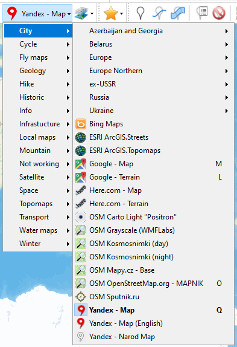
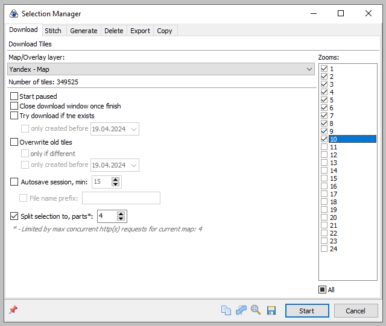
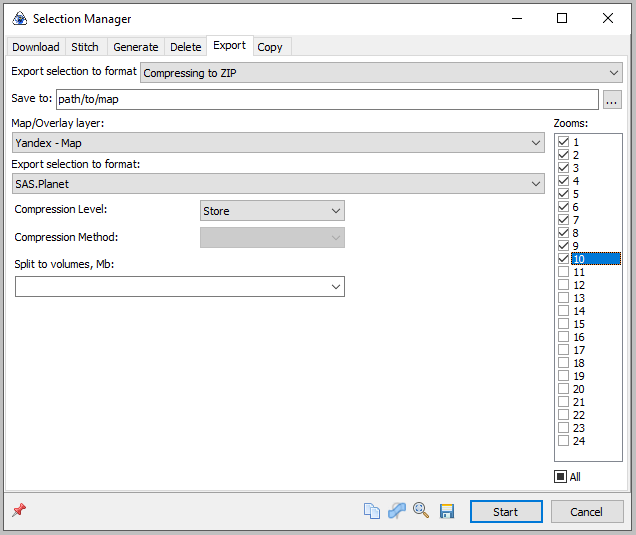
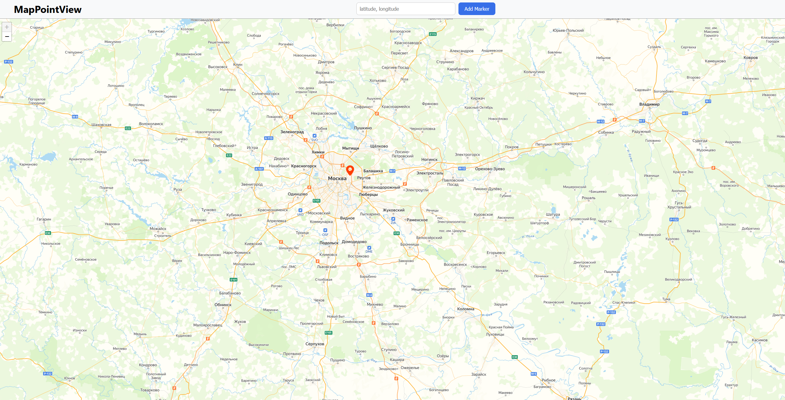

# MapPointView

## Описание

Данная программа предназначена для просмотра карт мира и установки маркеров по координатам в оффлайн режиме.
Программа использует картографические тайлы, загружаемые через SAS Planet, и позволяет пользователю
взаимодействовать с картой без необходимости подключения к интернету.

## Скачивание тайлов для карт

### Способ 1: Скачивание готового архива с тайлами

Необходимо зайти на  и скачать архив содержащий 10 слоёв карты всего мира.

### Способ 2: Загрузка тайлов с помощью SAS Planet

**Загрузка программы:**

Сначала необходимо загрузить и установить программу SAS Planet.
Последнюю стабильную версию можно скачать с официального сайта [SAS Planet](https://www.sasgis.org/sasplaneta/).

Распакуйте архив с программой в любую папку на диске.
Если у вас в системе включён UAC, то не распаковывайте архив в системные каталоги! Оттуда программа
не сможет работать без прав Администратора, т.к. она хранит все свои настройки и данные внутри выбранной папки.
И желательно, чтобы в имени папки не было пробелов и русских (или любых других не латинских) символов.
Хорошее имя папки для установки: D:\SASPlanet\

**Настройка программы:**

Добавьте карты (они же, zmp) в папку Maps (внутри папки с программой).
Ссылки на загрузку карт можно найти на [странице загрузки программы](http://www.sasgis.org/download/).
Прочитайте readme из архива с картами (если он есть) и действуйте в соответствии с ним.

Создайте ярлык для SASPlanet.exe на рабочем столе и запустите программу.

**Выбор карт и зон для загрузки:**

Запустите SAS Planet, выберите нужные карты.



далее переходим в режим выделения нажатием Alt + R и выделяем нужную область карты (либо всю карту).
После выделения открывается окно сохранения данных в кэше программы, в котором нужно выбрать необходимые уровни зума.



**Экспорт тайлов:**

После того как тайлы скачаются в кэш программы, нужно ещё раз выделить нужную область и перейти во вкладку Export.
В этой вкладке необходимо указать путь для скачивания архива и ещё раз выбрать нужные уровни зума.



## Подготовка проекта

1. Распакуйте скачанный архив с тайлами в папку `Map`. Путь до тайлов должен выглядеть следующим образом: `Map/z{z}/0/x{x}/0/y{y}.png`

2. Установите виртуальное окружение для работы с визуальной частью и сервером:
   ```bash
   path/to/python -m venv venv
   ```

В этой команде `path/to/python` должен быть заменён на путь к интерпретатору Python, который вы хотите использовать.

3. Активируйте виртуальное окружение:
   ```bash
   venv\Scripts\activate
   ```

4. Установите необходимые зависимости для работы с визуальной частью и сервером:
   ```bash
   python -m pip install -r requirements.txt
   ```

## Использование

Запустите приложение командой:

   ```bash
   path/to/python manage.py runserver
   ```

Веб-интерфейс будет доступен по адресу [http://127.0.0.1:8000/](http://127.0.0.1:8000/).

### Работа с картой:



- Взаимодействуйте с картой, используя локально сохранённые тайлы.
- Установка маркеров на карте возможна путём клика по нужному месту или введения координат через запятую в специальное
  поле.
- Позиции маркеров сохраняются в local storage браузера, обеспечивая их доступность при повторных сессиях.

## Версии

- **Python** - v3.12
- **SAS Planet** - v.230909
- **Node.js** - v18.18.0
- **npm** - v10.2.0

## Ссылки на загрузку

- [Python](https://www.python.org/downloads/) - для установки python.
- [SAS Planet](https://www.sasgis.org/sasplaneta/) - для скачивания и работы с тайлами карт.
- [Node.js](https://nodejs.org/) - для установки и работы с npm.
